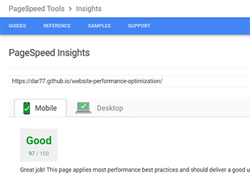

### Frontend Nanodegree Project
___

# Website Performance Optimization Project

For this project I needed to optimize a provided online portfolio website for speed and in particular optimize the **critical rendering path** using the skills I've learned in the course. Also the provided portfolio contained a pizza.html page that featured poorly performing animation that needed to be optimized so that it ran at **60 frames per second** with smooth animation 'jank' free!

This is a project from Udacity's **Frontend Nanodegree** [program](https://www.udacity.com/course/front-end-web-developer-nanodegree--nd001).
___


## Overview

#### Part 1: optimize page speed insights score for index.html

The provided websites index.html file (currently very slow running) must be optimized so that it renders as fast as possible and achieves a **PageSpeed Insights** score of at least 90 for both desktop and mobile.

#### Part 2: optimize frames per second in pizza.html

Optimize the provided slow running views/pizza.html making changes to views/js/main.js to optimize the **pixels to screen pipeline** until you achieve **60 frames per second** or higher when scrolling the page. Also the 'pizza size changer' slider must acheive a resize time of less than 5 ms.
___


### Optimized Page

Visit optimized website: [Optimized](https://dar77.github.io/website-performance-optimization/)




### Original Page

Visit original websites Git Hub repository: [Before optimization](https://github.com/udacity/frontend-nanodegree-mobile-portfolio)


___


## Installation

To run the project please **fork** a copy to your **Git Hub** account and **clone** to your local machine with **Git**.

- Open **index.html** in the browser to view.

### To run Grunt tasks

I've used the **Grunt** task runner to minify / copy my code and process images etc. **Please Note** the processed files already exist in the **dist** directory, you only need to run **Grunt** for testing purposes. If you do not have **Node.js** and the **Grunt CLI** running on your system, follow these steps:

### Install Node.js and Grunt CLI

1. To use **Grunt** you will need to have **Node.js** running on your system. [down load node](https://nodejs.org/en/).
2. Change to the project's root directory:
```bash
   cd /example/path/to/project-directory
```
3. Install the projects dependencies (these are listed in the package.json file) by running:
```bash
   npm install
```
4. You then need to have the **Grunt command line interface (CLI)** installed globally. Run the following on Node.js command line:
```bash
   npm install -g grunt-cli
```
5. Continue with step **3** from instructions below:


### You have Node.js and the Grunt CLI

1. Change to the project's root directory (if you are not already in that location):
```bash
   cd /example/path/to/project-directory
```
2. Install the projects dependencies (these are listed in the package.json file) by running:
```bash
   npm install
```
3. Run grunt tasks with:
```bash
   grunt
```

#### Notes:

- Running **grunt** will **delete** the current content of **dist** directory
- Then it will process folders and files in **src** directory and send processed versions to **dist** directory.
- **Please Note** the **dist** directory already contains these processed files. You can run **Grunt** for testing purposes.
- **.html** files in project root are set up to reference contents of **dist** directory.

See these extra instructions for [getting started with Grunt](https://gruntjs.com/getting-started) (if needed).
___


## Solution - Part One

To reach the **PageSpeed Insights** target of **90** or above I optimized the **critical rendering path** by reducing the number of **render and parser blocking resources** the browser is handed. Also I reduced the size of those resources where possible.

- I moved the javascript files to the bottom of the page before the closing **body** tag.
- For external scripts I added an **async** attribute to the **script** tag.
- I inlined the **css** in the head of the document. Which goes against what I would normally do (separation of concerns). This seemed necessary to get the **render blocking resources** removed and achieve the speed needed.
- I moved the **print.css** into a script that defers its loading. In addition I'd added a media attribute of print.
- I removed the **Google Fonts** link and instead used the same font in a downloaded **@fontface** Open Sans type face. (saved on an http request)
- I added a **rel='preload'** link in the head that suggests moving the request for the fonts earlier in the page load. (without blocking behavior)
- Using **Grunt** all **css** and **javascript** was minified to reduce bytes.
- For images I settled on using **data uri's** to inline the images direct in the **index.html**. (reducing http requests)
- I used **Git Hub** hosting to run the website through **PageSpeed Insights**. https://dar77.github.io/website-performance-optimization/

This reduced **index.html** number of **critical resources** to just the **html**.

- For the other **.html** files I used external **css** files marked with media attributes for print and portrait. (reducing size of critical resources)
- For images I used a combination of **data uri** and **Grunt** processed **webp** files with regular **jpeg** files as a fall back.
___


## Solution - Part Two

Visit the optimized pizza.html: [website](https://dar77.github.io/website-performance-optimization/dist/views/pizza.html)


___

- As with the previous part of project the **css** and **javascript** files were minified using **Grunt**.
- Images were reduced in file size.

### Changes in views/js/main.js

To speed up the slider for changing pizza sizes I made the following changes:

- Completely removed the **determineDx()**, **sizeSwitcher()** and **changePizzaSizes()** functions. The **determineDx()** function was overly complicated and not necessary to achieve the goal of simply resizing the pizza image.
- In the case of the **changePizzaSizes()** function this code was causing a **forced synchronous layout** because it contained a loop making calls to layout followed by changes to styles.

#### Old changePizzaSizes() function

```javascript
  function changePizzaSizes(size) {
    for (var i = 0; i < document.querySelectorAll(".randomPizzaContainer").length; i++) {
      var dx = determineDx(document.querySelectorAll(".randomPizzaContainer")[i], size);
      var newwidth = (document.querySelectorAll(".randomPizzaContainer")[i].offsetWidth + dx) + 'px';
      document.querySelectorAll(".randomPizzaContainer")[i].style.width = newwidth;
    }
  }
```


- The new code uses a **switch statement** with percentage widths to adjust pizza size.
- The **randomPizzaContainer** class name is accessed outside of the loop with **getElementsByClassName**.
- A length variable is assigned the **pizzaContainer.length** value outside of the loop.
- The loop now only needs to apply the styles.

#### New changePizzaSizes() function

```javascript
  // The new code uses percentage values for each slider position
  function changePizzaSizes(size) {
      var newWidth;
      switch(size) {
        case "1":
          newWidth = 25;
          break;
        case "2":
          newWidth = 33.3;
          break;
        case "3":
          newWidth = 50;
          break;
        default:
          console.log("bug in sizeSwitcher");
    }
    /* in the removed code the function repeated itself and made layout calls followed by
     change of styles within the loop causing 'forced synchronous layout' */
    var pizzaContainer = document.getElementsByClassName("randomPizzaContainer"); // changed from querySelectorAll to getElementsByClassName
    var length = pizzaContainer.length;
    for (var i = 0; i < length; i++) {
      pizzaContainer[i].style.width = newWidth + "%";
    }
  }

  changePizzaSizes(size);
```

To acheive the required 60 frames a second on scroll for pizza.html, I made the following changes:

- Changed the **updatePositions()** function that included lots of calculations that were being carried out on every iteration of the loop.

#### New updatePositions() function

- Used **getElementsByClassName** to grab all of the **mover** class animated pizzas. Moved this out into global scope so it isn't accessed every time **updatePositions()** runs.
- Moved the **(document.body.scrollTop / 1250)** calculation out of the loop.
- Assigned **items.length** to a variable outside of loop.
- Added an **if statement** to control animation speed after initial page load.
- Used **style.transform = "translateX()"** instead of **style.left** to position elements for better animation performance.

```javascript
  var items = document.getElementsByClassName("mover"); //replaced querySelectorAll with getElementsByClassName
  // made items global, so that it doesn't run every time with updatePositions() function

  // Moves the sliding background pizzas based on scroll position
  function updatePositions(m) {
  frame++;
  window.performance.mark("mark_start_frame");

  /*original loop removed
  var items = document.querySelectorAll('.mover');
  for (var i = 0; i < items.length; i++) {
    var phase = Math.sin((document.body.scrollTop / 1250) + (i % 5));
    console.log(phase);
    items[i].style.left = items[i].basicLeft + 100 * phase + 'px';
    console.log(items[i].style.left);
  }
  */

  // below - code for new updatePositions function
  var scroll = (document.body.scrollTop / 1250); // moved calculation out of loop
  var l = items.length; //access .length outside of loop
  var phase;
  var x;
  var i;

  if (m != 100) { // after the initial positioning of the pizzas use a smaller increment to animate
    m = 5;
  }

  for (i = 0; i < l; i++) {
    phase = Math.sin(scroll + (i % 5));
    x = items[i].basicLeft += m * phase;
    items[i].style.transform = "translateX(" + x + "px)"; // removed style.left added transform: translateX()
  }
```

- Adjusted **addEventListener** by using **requestAnimationFrame** to help schedule the running of **updatePositions()** function more efficiently when the user scrolls.
- Added the **requestAnimationFrame polyfill** at the top of the file.

```javascript
  // Removed - runs updatePositions on scroll
  // window.addEventListener('scroll', updatePositions);

  // New code below, updatePositions() now runs with requestAnimationFrame() on scroll
  window.addEventListener('scroll', function(){
     requestAnimationFrame(updatePositions);
  });
```

- Used the variable **res** to hold the calculation for the number of pizzas needed to fill the screen dynamically reducing the number of animated pizzas from 200.
- Used **getElementById** to access the **movingPizzas1** id and moved it out of the loop.
- Moved the **height** and **width** image size properties to the **css**.
- Added an initial layout parameter for **updatePositions(100)**.

```javascript
  // Generates the sliding pizzas when the page loads.
  document.addEventListener('DOMContentLoaded', function() {
  var cols = 8;
  var s = 256;
  var res = ((screen.height) / s) * cols; // screen height divided by 256 x 8
  var selection = document.getElementById("movingPizzas1"); // moved document.querySelector out of loop, changed to get by id
  //for (var i = 0; i < 200; i++) {
  for (var i = 0; i < res; i++) { // dynamically updates number of pizzas based on screen height
    var elem = document.createElement('img');
    elem.className = 'mover';
    elem.src = "images/pizza-extra-small.png";
    //elem.style.height = "94px"; // height and width values for image moved to css
    //elem.style.width = "73px";
    elem.basicLeft = (i % cols) * s;
    elem.style.top = (Math.floor(i / cols) * s) + 'px';
    selection.appendChild(elem);
  }
  updatePositions(100); // updatePositions run with starting layout argument
});
```

#### Changes in views/css/style.css

I made the following small changes in the **css** file (commented):

- Added a **left** property to **.mover** class to control the initial layout of pizzas when using the **transform: translateX()** rule in the **js**.
- Added **will-change: transform** and **transform: translateZ(0)** to give the animated pizzas their own compositing layer and drastically reduce the need to re-paint the screen.

```css
	.mover {
	  position: fixed;
	  width: 256px;
	  z-index: -1;
	  left: 0%; /* adjustment to positioning of pizzas when using transform: translateX*/
	  will-change: transform; /* suggestion to browser to place this element on its own layer */
	  transform: translateZ(0); /* places selected element on its own layer, (for older browsers)*/
	}
```

- Added a style rule for animated pizzas that defines their **height** and **width** properties, previously applied in the **js**.

```css
	img.mover {
	  width: 73px; /* pizza image width and height now defined in the css*/
	  height: 94px;
	}
```
___
